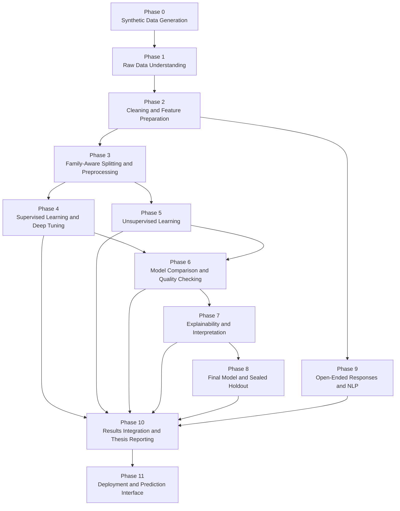

# Machine Learning Analysis of Students’ Academic Performance in Bahrain

<p align="center">
  <strong>Master’s Thesis — MSc in Artificial Intelligence</strong><br>
  Bahrain Polytechnic
</p>

<p align="center">
  
  
  
  
  
</p>

---

## Thesis Title

**Design a Machine Learning Approach to Analyse Students’ Performance Based on Their Socio-economic Status in the Kingdom of Bahrain**

## Researcher

**Jaafar Isa Mohamed Isa Ahmed**  
MSc in Artificial Intelligence — Bahrain Polytechnic

> This repository is maintained to allow the thesis supervisor to review the research workflow, methodological decisions, implementation progress, and generated analytical outputs.

---

## 1. Project Overview

This research develops and evaluates a machine learning framework for analysing students’ academic performance in the Kingdom of Bahrain using socio-economic, demographic, family, educational-support, health, and behavioural factors.

The prediction task is formulated as a multiclass classification problem:

| Class | Meaning |
|---|---|
| `Low` | Lower academic-performance category |
| `Medium` | Moderate academic-performance category |
| `High` | Higher academic-performance category |

The framework is designed to support educational analysis and early intervention. It is **not** intended to make automatic high-stakes decisions, punish students, or replace professional educational judgement.

---

## 2. Research Objectives

The project aims to:

1. Develop a reproducible machine learning pipeline for analysing academic-performance categories.
2. Compare multiple supervised learning algorithms using general and class-specific evaluation metrics.
3. investigate whether deep hyperparameter tuning improves performance over baseline models.
4. Identify the socio-economic and educational factors most strongly associated with model predictions.
5. Explore natural student profiles through unsupervised learning.
6. Analyse open-ended questionnaire responses using natural language processing.
7. assess model stability, subgroup performance, fairness, calibration, and uncertainty.
8. produce an interpretable decision-support prototype for academic demonstration.

---

## 3. Main Research Questions

1. Which supervised machine learning model provides the strongest and most stable multiclass performance?
2. Which socio-economic, demographic, family, educational, health, and behavioural factors are most influential?
3. How does hyperparameter tuning affect Accuracy, Balanced Accuracy, Recall, F1-score, Macro F1, class-specific performance, and other metrics?
4. Can unsupervised learning identify meaningful student profiles?
5. What themes emerge from open-ended questionnaire responses?
6. Are model outcomes consistent across relevant student subgroups?

---

## 4. End-to-End Research Workflow



---

## 5. Phase Progress

| Phase | Name | Purpose | Current status |
|---:|---|---|---|
| 0 | Synthetic Data Generation | Generates a documented alternative dataset when real data are unavailable or insufficient. | Optional / used only when required |
| 1 | Project Setup and Raw Data Understanding | Loads the original dataset, documents its structure, and performs initial quality and exploratory checks. | Implemented |
| 2 | Data Cleaning and Feature Preparation | Cleans variables, addresses missing or inconsistent values, constructs the target, and prepares modelling features. | Implemented |
| 3 | Train–Test Split and Preprocessing Pipelines | Creates family-aware training, validation, and sealed holdout partitions and defines preprocessing pipelines. | Implemented |
| 4 | Supervised Learning Algorithms | Trains baseline and tuned models, performs nested family-aware validation, and compares a wide range of metrics. | Rebuilt for deep tuning; final heavy run pending |
| 5 | Unsupervised Learning Analysis | Applies PCA and K-Means to identify student profiles without using the target during clustering. | Implemented |
| 6 | Model Comparison and Quality Checking | Assesses performance, stability, generalisation, errors, learning curves, fairness, and robustness. | Implemented; must be rerun after final Phase 4 |
| 7 | Model Explainability and Interpretation | Uses permutation importance, SHAP/Shapley analysis, and consensus rankings to interpret model behaviour. | Implemented; must be rerun after final Phase 4 |
| 8 | Final Model and Holdout Evaluation | Retrains the selected model and evaluates it once on the sealed holdout dataset. | Dry-run only; holdout remains sealed |
| 9 | Open-Ended Responses and NLP Analysis | Cleans and analyses Arabic/English open-ended responses using TF-IDF, topic modelling, and text clustering. | Implemented; manual topic review pending |
| 10 | Final Results Integration and Thesis Reporting | Integrates results from all phases and generates thesis-ready tables, figures, and reporting drafts. | Draft integration implemented |
| 11 | Deployment and Prediction Interface | Provides a bilingual demonstration interface for individual and batch predictions. | Development demo implemented |

### Important current research status

The repository contains a complete end-to-end implementation, but the following steps remain before the results can be treated as final thesis findings:

- Run the rebuilt **Phase 4 deep hyperparameter tuning** on the researcher’s main computing environment.
- Rerun Phases **6 and 7** using the updated Phase 4 outputs.
- Complete Phase **8** in final mode and open the sealed holdout exactly once.
- Review and confirm the automatically generated Phase 9 topic labels.
- Rerun Phase **10** in final-thesis mode.
- Rebuild Phase **11** using the final approved model.

No provisional or validation-only result should be reported as a final thesis result.

---

## 6. Supervised Learning Models

Phase 4 evaluates the following algorithms:

1. Logistic Regression
2. K-Nearest Neighbours
3. Support Vector Machine
4. Decision Tree
5. Random Forest
6. Gradient Boosting
7. XGBoost
8. CatBoost
9. Multi-Layer Perceptron

A Dummy Classifier is also used as a reference baseline.

### Baseline versus tuned comparison

Each model is evaluated before and after hyperparameter tuning. The comparison includes:

- Accuracy
- Balanced Accuracy
- Macro Precision
- Macro Recall
- Macro F1
- Micro F1
- Weighted F1
- Precision, Recall, F1, and Specificity for `Low`, `Medium`, and `High`
- ROC-AUC
- Precision–Recall AUC
- Multiclass Log Loss
- Multiclass Brier Score
- Cohen’s Kappa
- Matthews Correlation Coefficient
- Expected Calibration Error
- Confusion matrices
- Generalisation gap
- Training and prediction time

The tuning process uses family-aware nested cross-validation to reduce optimistic bias and prevent members of the same family from appearing in both training and validation partitions.

---

## 7. Methodological Safeguards

### Family-aware validation

Students belonging to the same family are kept together during splitting and cross-validation. This reduces family-level information leakage.

### Sealed holdout

The holdout dataset is isolated in Phase 3 and must remain unopened throughout model development, comparison, tuning, and explanation. It is used only once in Phase 8 after the final model and hyperparameters are frozen.

### Leakage prevention

Direct identifiers, target-derived variables, and variables that could reveal the outcome are excluded from the predictor set.

### Reproducibility

The notebooks use:

- fixed random seeds;
- saved fold assignments;
- manifests and lineage reports;
- exported model configurations;
- structured output directories;
- machine-readable CSV, JSON, and Excel reports.

### Responsible AI

The model is a research and decision-support tool only. Predictions must not be used to label, punish, exclude, or automatically rank students without appropriate human review.

---

## 8. Repository Structure

```text
.
├── README.md
├── LICENSE
├── requirements.txt
├── .gitignore
│
├── notebooks/
│   ├── Phase_00_*.ipynb
│   ├── Phase_01_*.ipynb
│   ├── Phase_02_*.ipynb
│   ├── Phase_03_*.ipynb
│   ├── Phase_04_*.ipynb
│   ├── Phase_05_*.ipynb
│   ├── Phase_06_*.ipynb
│   ├── Phase_07_*.ipynb
│   ├── Phase_08_*.ipynb
│   ├── Phase_09_*.ipynb
│   ├── Phase_10_*.ipynb
│   └── Phase_11_*.ipynb
│
├── app/
│   ├── app.py
│   ├── inference_engine.py
│   ├── config/
│   ├── models/
│   └── templates/
│
├── outputs/
│   ├── Phase_01/
│   ├── Phase_02/
│   ├── ...
│   └── Phase_11/
│
├── docs/
│   ├── methodology.md
│   ├── deployment.md
│   └── model_card.md
│
└── tests/
    └── test_inference.py
```

> Raw datasets, sealed holdout files, personal information, and confidential Ministry of Education data must not be committed to this repository.

---

## 9. Recommended Notebook Execution Order

Run the notebooks in the following sequence:

```text
Phase 0  — only when synthetic data are required
Phase 1  — raw data setup and understanding
Phase 2  — cleaning and feature preparation
Phase 3  — splitting and preprocessing
Phase 4  — supervised learning and deep tuning
Phase 5  — unsupervised learning
Phase 6  — comparison and quality checking
Phase 7  — explainability and interpretation
Phase 8  — final model and sealed holdout evaluation
Phase 9  — open-ended responses and NLP
Phase 10 — final integration and thesis reporting
Phase 11 — deployment and prediction interface
```

After updating Phase 4, the minimum required rerun sequence is:

```text
Phase 4 → Phase 6 → Phase 7 → Phase 8 → Phase 10 → Phase 11
```

Phase 5 and Phase 9 should also be rerun when their input data or methodological settings change.

---

## 10. Installation

### Create a virtual environment

```bash
python -m venv .venv
```

Activate it on Windows:

```bash
.venv\Scripts\activate
```

Activate it on Linux or macOS:

```bash
source .venv/bin/activate
```

### Install dependencies

```bash
python -m pip install --upgrade pip
python -m pip install -r requirements.txt
```

### Start Jupyter

```bash
jupyter notebook
```

---

## 11. Running the Demonstration Interface

The Phase 11 interface is a research demonstration and may remain in `DEVELOPMENT_DEMO` mode until the final model is approved.

```bash
streamlit run app/app.py
```

The interface supports:

- individual prediction;
- batch CSV prediction;
- probabilities for all three classes;
- confidence and uncertainty indicators;
- local one-feature-at-a-time sensitivity;
- bilingual Arabic/English presentation;
- human-review warnings.

---

## 12. Data Governance and Privacy

This repository must not contain:

- student names;
- national identification numbers;
- telephone numbers;
- email addresses;
- exact residential addresses;
- raw questionnaire exports containing identifiable information;
- confidential Ministry of Education records;
- the sealed holdout dataset;
- authentication keys or passwords.

The study works with anonymised or synthetic data. Any restricted dataset must remain outside GitHub and be accessed only through approved institutional storage.

---

## 13. Interpretation of Results

Several methodological cautions apply:

- Predictive association does not establish causality.
- Feature importance does not prove that changing a variable will change a student’s academic outcome.
- High overall Accuracy can hide weak performance for one class.
- Macro F1 and Balanced Accuracy are prioritised because all three performance classes are important.
- Tuned models are not automatically preferred; the selected version must demonstrate stronger validated performance and acceptable class-specific behaviour.
- Subgroup differences require careful contextual interpretation and must not be used to stigmatise students or families.
- NLP topics are automatically generated and require researcher review before inclusion in the thesis.

---

## 14. Outputs Produced by the Pipeline

Depending on the phase, the notebooks generate:

- cleaned and documented datasets;
- family-aware split and fold manifests;
- baseline and tuned model results;
- fold-level and summary metrics;
- confusion matrices and classification reports;
- best hyperparameter tables;
- robustness and statistical tests;
- PCA and clustering profiles;
- subgroup and fairness evaluations;
- SHAP and permutation-importance results;
- open-ended response topics and text clusters;
- thesis-ready figures and tables;
- model cards and deployment manifests;
- a Streamlit demonstration application.

Large generated outputs should normally be excluded from GitHub and retained in the local `outputs/` directory or approved research storage.

---

## 15. Current Limitations

The current implementation is subject to the following limitations:

1. The final performance depends on the quality, size, representativeness, and provenance of the available dataset.
2. Questionnaire variables may contain self-reporting and sampling bias.
3. Synthetic data, when used, cannot replace independent real-world validation.
4. Some classes may remain difficult to distinguish because academic performance is influenced by factors not captured in the dataset.
5. Hyperparameter tuning can improve validation performance but cannot create predictive information that is absent from the data.
6. Final claims must wait until the sealed holdout evaluation is completed.
7. Automatically generated NLP topics require manual academic interpretation.

---

## 16. Academic Use and Citation

This repository documents work undertaken as part of a Master’s thesis at Bahrain Polytechnic.

Suggested citation:

```text
Ahmed, J. I. M. I. (2026).
Design a Machine Learning Approach to Analyse Students’ Performance
Based on Their Socio-economic Status in the Kingdom of Bahrain.
Master’s thesis project, Bahrain Polytechnic.
```

---

## 17. Supervisor Review Guide

For a rapid review of progress:

1. Start with the **Phase Progress** table in this README.
2. Review notebooks in numerical order.
3. In Phase 4, inspect the baseline-versus-tuned tables and tuning diagnostics.
4. In Phase 6, inspect model stability, errors, fairness, and finalist selection.
5. In Phase 7, inspect global and class-specific explanation results.
6. In Phase 8, confirm whether the notebook is in `DRY_RUN` or final holdout mode.
7. In Phase 9, review the researcher-confirmed topic labels.
8. In Phase 10, confirm whether the report is marked draft or final.
9. In Phase 11, confirm whether deployment is marked `DEVELOPMENT_DEMO` or `PRODUCTION`.

---

## 18. Project Status Summary

```text
Research pipeline architecture:       Complete
Data preparation workflow:            Complete
Family-aware experimental design:     Complete
Initial supervised modelling:         Complete
Deep-tuning implementation:           Complete
Final deep-tuning execution:          Pending
Unsupervised analysis:                Complete
Model quality and fairness analysis:  Implemented; rerun pending
Model explainability:                 Implemented; rerun pending
Final sealed holdout evaluation:      Pending
Open-ended response analysis:         Implemented; review pending
Thesis reporting integration:         Draft complete
Deployment prototype:                 Development demo complete
```

---

## 19. Disclaimer

This repository contains research software under active development. Intermediate metrics, provisional model rankings, automatically generated interpretations, and demonstration predictions must not be treated as final scientific findings or operational educational decisions until the complete validation and approval process has been completed.

---

<p align="center">
  <strong>Research in progress — reproducibility, transparency, and responsible AI are central to this project.</strong>
</p>
